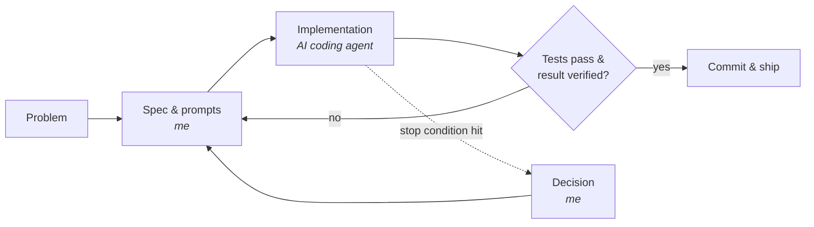

# AI Portfolio: Viktor Liikamaa

Case studies, agent skills, prompt templates and research from systems I have built by directing AI coding agents.

> I don't have a computer science degree. I work as the architect: I define the problem, design the system, write the specifications and prompts, and let AI agents (mainly Claude Code in Cursor) implement. Then I test, verify and correct until it holds up in real use.

## How I work

Three principles run through every project:

- **Prove it wrong first.** Before investing in an idea, I try to disprove it with real data. Several projects in this repo changed direction or stopped because of that.
- **Never trust output blindly.** AI is fluent whether or not it is right. I build in tests, checks and verification, and I have caught stale models, invented health claims and silently broken scrapers.
- **Small, tested steps.** Work is cut into thin slices, each tested and committed before the next. The agent has written rules for when it must stop and ask me.

## Projects

| Project | What it shows | Status |
| --- | --- | --- |
| [Sales CRM](projects/sales-crm/) | Building a working tool without an engineering background; agent escalation rules | Built, not adopted |
| [Crypto volatility scanner](projects/crypto-volatility-scanner/) | ML in production, a rigorous post-mortem, why a better model traded worse | Redesigned, validating |
| [DeFi liquidation study](projects/defi-liquidation-study/) | Hypothesis testing on on-chain data; a clean negative result | Concluded |
| [LLM claims verification](projects/llm-claims-verification/) | Catching and fixing unsupported claims in AI-generated content | Built into pipeline |
| [Ad intelligence](projects/ad-intelligence/) | Scraping, LLM analysis and silent-failure hunting | Built |

## Also in this repo

- [`agent-skills/`](agent-skills/): a reusable skill that tells a coding agent how to build, and when to stop
- [`prompts/`](prompts/): prompt templates I use for audits and safe changes to live systems
- [`research/`](research/): four working papers written up from these projects

## About code

Most of these systems touch client data, trading infrastructure or a business in progress, so their source code is private. This repo shows the parts that demonstrate how I work: specifications, agent instructions, prompts, architecture and results.

## Contact

📫 viktorliikamaa@gmail.com · Stockholm, Sweden
