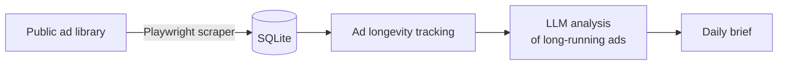

# Ad and e-commerce intelligence

AdRadar is a single-file Python service that finds which ads are working in a niche and delivers a daily brief. It sits alongside a set of e-commerce research tools for product discovery, competitor analysis and alerting.

## How it works

The key idea: an advertiser keeps paying for an ad that makes money. **How long an ad keeps running is a free, public proxy for profitability.** The service tracks each ad's first-seen date, flags the ones that keep running, and has an LLM break down what the winners have in common: hooks, angles, offers and formats.

## The silent failures I had to hunt down across these tools

None of these raised an error. Each produced plausible, wrong output.

| Failure | What it looked like | Fix |
| --- | --- | --- |
| Scraper anchored on visual CSS classes | Worked, then returned nothing after a site update | Anchor on stable ad-ID text instead |
| Date parsing only understood English | Swedish results silently returned zero ads, which looked like a quiet market | Multi-locale date patterns |
| EU vs US date order and day counting | Wrong "days running" for some ads | Explicit format handling, recalculated durations |
| A store API ignored a sort parameter | "Best-sellers" were really in default order | Parse the rendered page instead |
| A missing snapshot read as a rank change | False alerts | Skip comparisons when data is missing |

**Lesson:** "it ran and produced output" is not a test. Every data source needs a check that the output is *plausible*, not just present.
