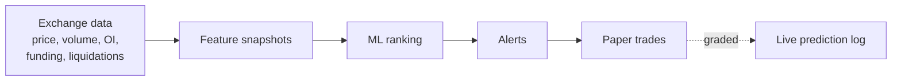

# Crypto volatility scanner: when the better model traded worse

A machine-learning scanner that watched ~313 perpetual futures contracts 24/7 and paper-traded its signals from March to August 2026. Offline it kept getting better. Live it got worse. This is the post-mortem.

## The idea

Periods of unusually low volatility and tight ranges tend to come before sharp moves. The scanner measured that compression across the whole market and ranked contracts by how likely a ≥5% move was.

## Offline vs live

| Version | Training data | Offline AUC |
| --- | --- | --- |
| Gen 1 | ~4,000 events | 0.643 |
| Gen 2 | ~40,000 snapshots | 0.82 |
| Gen 3 | ~780,000 rows | 0.841 reported |

But June, the only full month on the retrained model, was the **worst month of the run**: a 67% stop-loss rate (vs 46–49% before) and a 28.7% win rate. The live-graded AUC fell to **0.45–0.46, below chance**, in the final two weeks.

## The audit

I had an AI agent audit the preserved server state under a strict read-only brief with hypotheses set in advance ([prompt template](../../prompts/read-only-audit-brief.md)).

| Hypothesis | Verdict | Evidence |
| --- | --- | --- |
| Entries too late | ✅ Strongest | Median alert fired after >50% of the move; 52% of 1,948 trades stopped out; waiting 15–30 min beat immediate entry 71% of the time |
| Weak live prediction | ✅ Supported | Live AUC decayed below chance |
| Regime dependence | ✅ Supported | Longs lost most when Bitcoin trended up |

The audit's first pass was wrong too: it read a stale local copy and concluded the wrong model was live. It was corrected once it had access to the server. **Measure what is deployed, not what was reported**, including in your own audit.

## The root cause: features measured too late

Features were recorded, at the median, **101 minutes after the move had started**. The model had partly learned to recognise moves already under way, which scores well offline and arrives late live. Measured 15–30 minutes *before* onset, the signal was weaker (AUC 0.61–0.69) but kept positive expected value in a prospective test on 408,923 samples.

## The redesign

The model stopped predicting and started filtering: it builds a watchlist, and a price break triggers the entry. Historically this reached **67–70% follow-through at ~1.25 signals/day**. A short clean live window showed only ~22% raw follow-through on 114 signals, then silent infrastructure failures (frozen features, a crash loop, a full disk) ended the run. It is not validated live yet, and I say so.

## What I'd tell any small team running live ML

1. Log the served model's hash, training dates and score at every start.
2. Grade live predictions continuously against the offline score.
3. Record *when* each feature became available, not just its value.
4. Monitor data freshness, not just whether processes are running.

📄 Full paper: [When the Better Model Trades Worse](../../research/)
