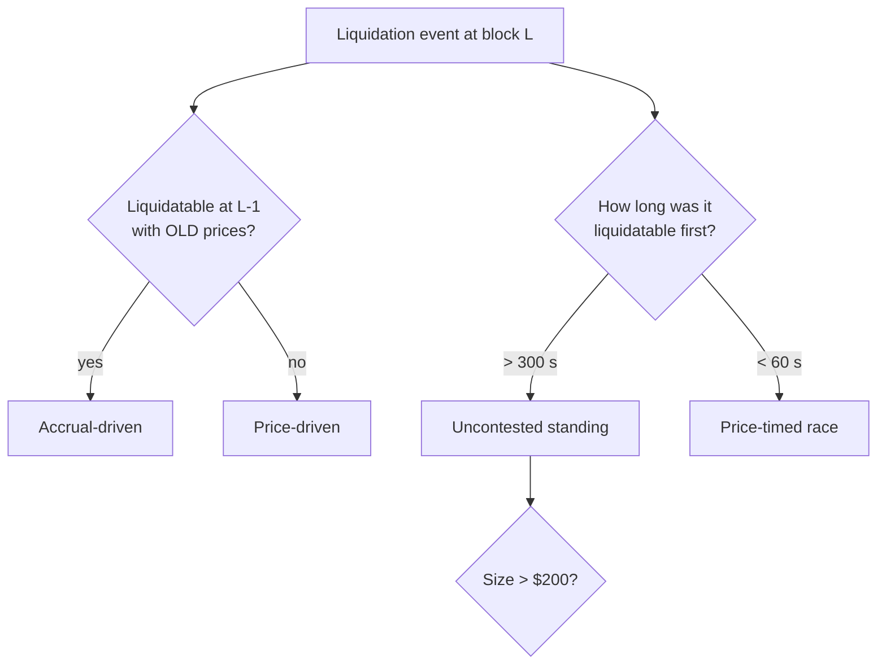

# Is there free money in DeFi liquidations?

A read-only empirical study that tested a popular idea before I spent weeks building on it. **Result: no.** A clean negative result, replicated on two protocols.

## The hypothesis

On lending protocols, loans can become liquidatable slowly as interest accrues, not only suddenly after a price move. If some of those positions sit unclaimed for minutes, a patient newcomer could collect them without winning speed races against professional bots.

> **H:** A material share of liquidation value comes from positions that stand liquidatable for minutes and aren't taken by dominant liquidators. *Material* = more than USD 200 of repaid debt.

## Method

For every liquidation in a 30-day window:

## Results

| | Aave v3 on Arbitrum | Morpho Blue on Base |
| --- | --- | --- |
| Accrual-driven share | 44% | 6.2% |
| Standing positions found | 23 | 16 |
| Value of standing positions | USD 11.97 total | USD 0.0000006–26.14 each |
| Standing positions > USD 200 | 0 | 0 |
| Competition | 19 of 23 still taken by top-10 bots | 63 liquidators, top share 15.6% |

The hypothesis is **rejected on both venues**. "Uncontested" positions weren't overlooked. They were too small for anyone to hurry.

## Two measurement traps worth knowing

1. **A true number that looked like a bug.** The first report showed values of `$0.00`. A full trace found no scaling error. The values really were fractions of a cent, and a 2-decimal display format hid them.
2. **A price that was 10× wrong.** When an exchange pool reported no liquidity, a fallback pricer used a near-empty pool. Fixed by requiring a small and a large quote to agree within 15%.

## What it was worth

Two read-only studies answered the question before any execution code (signing, transaction submission) was written. The monitoring system is more useful as a **risk sensor** for lending-vault curators than as a profit engine.

📄 Full paper: [Is There Free Money in DeFi Liquidations?](../../research/)
