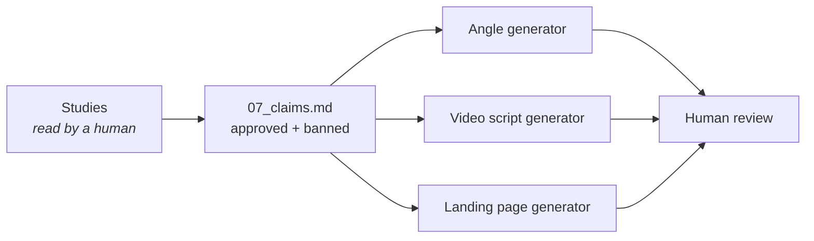

# Keeping LLM-generated marketing within the evidence

An LLM in my product-research pipeline wrote that pet water fountains make cats drink more, citing "peer-reviewed veterinary journals". I checked the journals. They didn't say that.

## What happened

The pipeline generated positioning, video ad scripts and landing-page copy for a cat water fountain. The model followed the category: fountains increase water intake and protect kidney health, backed by a vague appeal to research.

The studies behind the claim say something different:

- **Pachel & Neilson (2010):** individual cats vary; some clearly prefer flowing water, others don't.
- **Grant (2010):** no significant difference in average intake or urine concentration between water sources in healthy cats.

Published, the copy would have cited evidence that contradicts it.

## The fix: a claims file per product

| List | Examples |
| --- | --- |
| ✅ Approved, with citation | Some cats clearly prefer flowing water (Pachel & Neilson, 2010). Drinking from the tap is a visible sign of that. |
| ❌ Banned | "Proven to increase water intake." "Prevents kidney disease." Any "vets say" / "studies show" without a specific citation. |

The file is loaded automatically and injected into every generation step, with an explicit instruction to stay inside it.

## Result

All three regenerated ad variants stayed within the approved claims. And the honest version sold better on paper. One variant opened with *"We won't say it works for every cat"* and tied the 60-day return policy to the evidence that cats differ.

## Why this matters for LLM evaluation

The error wasn't a strange hallucination. It was the category's standard claim, repeated with a plausible source. You only catch that kind of error by **tracing the claim to its source**, not by judging whether it sounds right.

📄 Full paper: [Keeping LLM-Generated Marketing Within the Evidence](../../research/)
