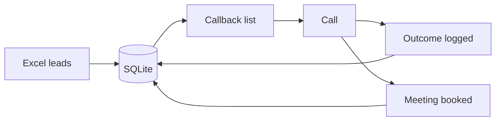

# Sales CRM for a wealth-management team

A custom CRM built to replace an off-the-shelf call-list tool for a Swedish sales team calling business owners. Built slice by slice by an AI coding agent under my direction. **It worked end to end, but the team never adopted it.**

## The problem

Generic CRMs are built for someone else's workflow. The team's real day is simple: call business owners, book meetings, and never miss a callback. The existing tool made the most frequent action, acting on a callback, the most awkward.

## What I built

| Slice | Delivered |
| --- | --- |
| 1 | Meeting automation: booking details turned into a structured meeting record and follow-up |
| 2 | SQLite database layer with lead import from Excel |
| 3 | Unified callback list showing who to call and when |
| 4 | Call outcome logging, closing the loop from call to next callback |
| 5 | Acting on the callback list directly from the call interface |

## How it was built

- **Thin slices.** Each slice was planned, built, tested and committed before the next one started. See the [build-slice skill](../../agent-skills/build-slice/).
- **AI kept out of the product where it isn't needed.** Only two narrow AI calls exist in the product code, each with a deterministic fallback, so the system works without an API key.
- **Tests as ground truth.** 25+ deterministic tests that run without network access. New commands were smoke-tested against a throwaway database, never real data.
- **Dummy data only during development.** Secrets and databases were excluded from version control from the first commit.

## The decision no test could make

After a full end-to-end run, everything passed, but the tool still didn't *feel* finished: acting on a callback meant editing the database by hand. That observation, from using it as a salesperson, defined slice 5. The agent wrote the code; knowing what "done" meant was my job.

## What I learned

The most valuable part of the process wasn't the build loop. It was writing down **when the agent must stop and ask me**: real personal data, decisions without a test signal, irreversible actions, and scope creep. Those rules later transferred unchanged to a completely different project.

The second lesson came after the build: the CRM worked, but the team kept using the old tool. Building something that works is only half the job. Getting people to switch to it is the other half.

📄 Full write-up: [Directing AI Coding Agents Without an Engineering Background](../../research/)
